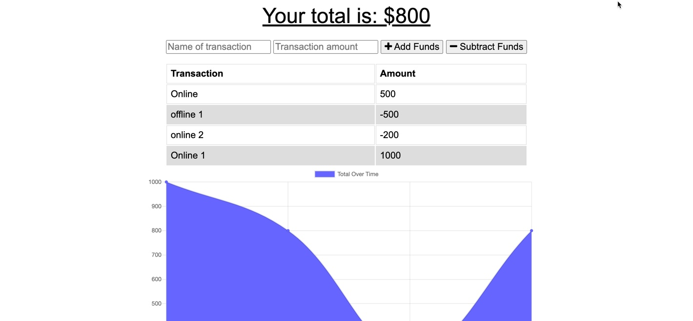

# budget-tracker-2

## Description
This is a budget tracker for an individual to track daily transactions and maintain access both online and offline



<a href="https://github.com/heather-everton/budget-tracker-2"><strong>Explore the docs »</strong></a>
<br />
<a href="https://budgeting-he.herokuapp.com/"><strong>Access the hosted application here</strong></a>
<br />

## Table of Contents
* [Installation](#installation)
* [Usage](#usage)
* [Contributing](#contributing)
* [Tests](#tests)
* [Questions](#questions)


## Installation
To install necessary dependencies, run the following command:
```
npm install
npm install express
npm install compression
npm install mongoose
npm install morgan

```
## Usage
    This application uses a service-worker to provide access to a mongo database online and maintain funcationality offline that will sync up when the application goes back online. 

## Contributing
If you're interested in contributing please reach out to me via email. 

## Tests
Test this application with chrome dev tools

## Questions
If you have any questions about the repo, open an issue or contact me directly at heathereverton88@gmail.com. You can find more of my work at (https://github.com/heather-everton/).

### Built With
* [npm](https://www.npmjs.com/)
* [express](https://expressjs.com/)
* [mongose](https://mongoosejs.com/)
* [indexDB API](https://developer.mozilla.org/en-US/docs/Web/API/IndexedDB_API)
* [Service Worker](https://developers.google.com/web/ilt/pwa/introduction-to-service-worker)


## Roadmap

See the [open issues](https://github.com/heather-everton/budget-tracker-2/issues) for a list of proposed features (and known issues).